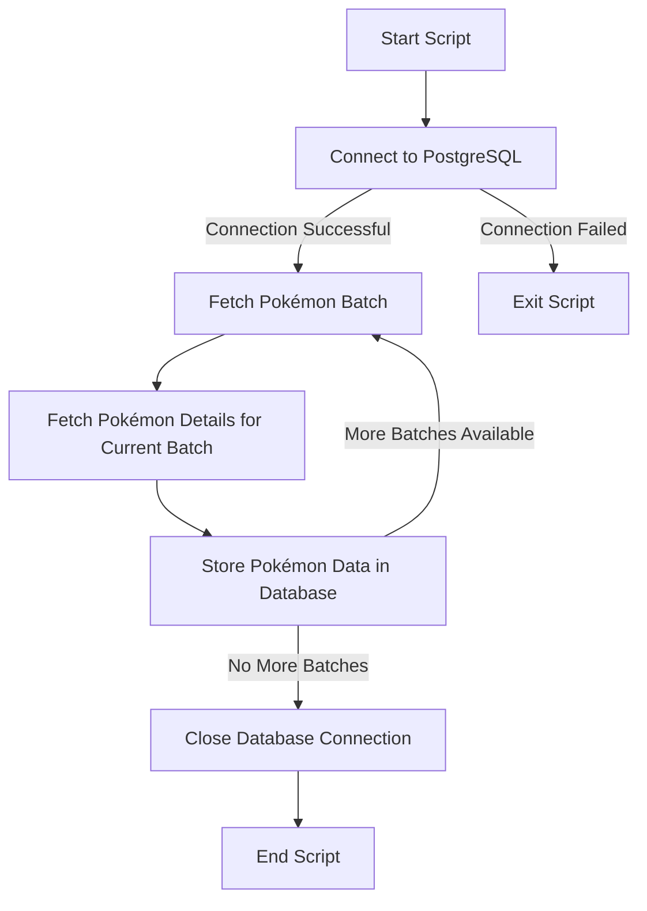

# Pokémon Data Fetch and Store Service

This script retrieves Pokémon data from PokeAPI and stores it in a PostgreSQL database.

## Workflow Diagram

```mermaid
graph TD
    A[Start Script] --> B[Connect to PostgreSQL]
    B -->|Connection Successful| C[Fetch Pokémon Batch]
    B -->|Connection Failed| D[Exit Script]
    C --> E[Fetch Pokémon Details for Current Batch]
    E --> F[Store Pokémon Data in Database]
    F -->|More Batches Available| C
    F -->|No More Batches| G[Close Database Connection]
    G --> H[End Script]

```
